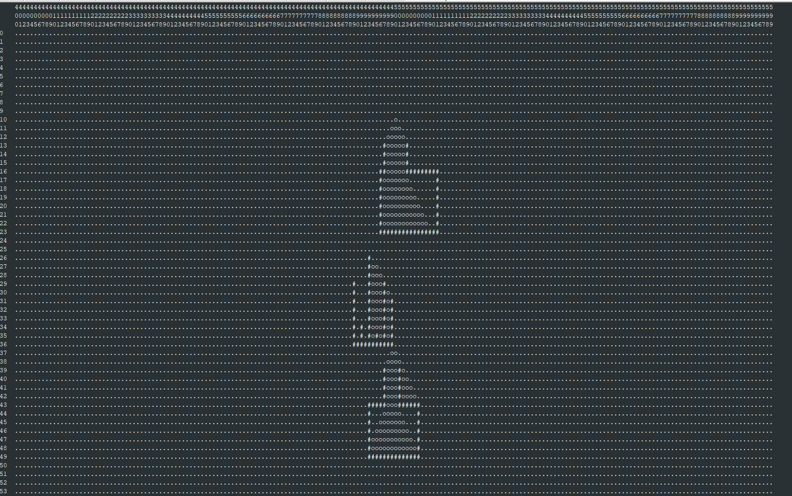

# My solution for Advent of Code 2022 <!-- omit in toc -->

This repo contains my solution for the Advent of Code 2022. The Advent of Code is an advent calendar containing little programming puzzles each day. For more information: https://adventofcode.com/2022/about.

My goal for the Advent of Code was to learn Go, a programming language I haven't used so far.

I have added some comments and ratings for the puzzles below, you will also find screenshots whenever I've implemented a visual solution.

1. [day 25](#day-25)
2. [day 24](#day-24)
3. [day 23](#day-23)
4. [day 22](#day-22)
5. [day 21](#day-21)
6. [day 20](#day-20)
7. [day 19](#day-19)
8. [day 18](#day-18)
9. [day 17](#day-17)
10. [day 16](#day-16)
11. [day 15](#day-15)
12. [day 14](#day-14)
13. [day 13](#day-13)
14. [day 12](#day-12)
15. [day 11](#day-11)
16. [day 10](#day-10)
17. [day 9](#day-9)
18. [day 8](#day-8)
19. [day 7](#day-7)
20. [day 6](#day-6)
21. [day 5](#day-5)
22. [day 4](#day-4)
23. [day 3](#day-3)
24. [day 2](#day-2)
25. [day 1](#day-1)

# day 25
|                           |                                                                                                                                                                                                                                                                                                                                                                                                                                                                                                                                                                                                     |
| ------------------------- | --------------------------------------------------------------------------------------------------------------------------------------------------------------------------------------------------------------------------------------------------------------------------------------------------------------------------------------------------------------------------------------------------------------------------------------------------------------------------------------------------------------------------------------------------------------------------------------------------- |
| **Puzzle rating**         | ★★★★★                                                                                                                                                                                                                                                                                                                                                                                                                                                                                                                                                                                               |
| **Rating of my solution** | ★★★★★                                                                                                                                                                                                                                                                                                                                                                                                                                                                                                                                                                                               |
| **Puzzle summary**        | Number conversion between decimal and a special number format called SNAFU that uses 5 as a base                                                                                                                                                                                                                                                                                                                                                                                                                                                                                                    |
| **Comment**               | I liked this puzzle a lot, it was nice to code and didn't take much time - a good ending to the advent of code. I'm saving the SNAFU numbers in an array, each entry representing a digit. When converting to int I can just multiply the value to the power of the index of the digit and sum up all values for all digits. For the other way around I'm converting the decimal number to a number of base 5 using Go's strconv. Then I iterate over all digits and if a digit is higher than 2 (highest SNAFU digit) I will turn it to a negative digit and increase the following digit instead. |
| **Screenshots**           | Left side of the table represents the SNAFU numbers, each digit to the base of 5. "-" equals value "-1" and "=" equals "-2".                                                                                                                                                                                                                                                                                                                                                                                                                            |
| **Ideas for improvement** | -                                                                                                                                                                                                                                                                                                                                                                                                                                                                                                                                                                                                   |

# day 24
|                           |                                                                                                                                                                                                                                                                                                                                                                                                                                                                                                                                                                                                                                                                                        |
| ------------------------- | -------------------------------------------------------------------------------------------------------------------------------------------------------------------------------------------------------------------------------------------------------------------------------------------------------------------------------------------------------------------------------------------------------------------------------------------------------------------------------------------------------------------------------------------------------------------------------------------------------------------------------------------------------------------------------------- |
| **Puzzle rating**         | ★★★★✰                                                                                                                                                                                                                                                                                                                                                                                                                                                                                                                                                                                                                                                                                  |
| **Rating of my solution** | ★★★✰✰                                                                                                                                                                                                                                                                                                                                                                                                                                                                                                                                                                                                                                                                                  |
| **Puzzle summary**        | Given a valley with moving blizzards one must find his way through the valley while avoiding the blizzards using the shortest path.                                                                                                                                                                                                                                                                                                                                                                                                                                                                                                                                                    |
| **Comment**               | My solution is a little slow, so I'm not completely happy with it, but it is returning the right results. I'm using a priority queue to find the next path I want to investigate. Priority is given by the shortest path length, if there are multiple paths with shortest length then the one with shortest distance to the target is chosen. For each path I'm detecting if a blizzard is moving to an adjacent tile or to the tile the actor is currently standing on. Based on that information the remaining possible paths are added to the queue. I'm using a cantor hash function to only look for paths that haven't been investigated at the same time and position already. |
| **Screenshots**           | Screenshot display the valley with its borders (#). At the top left corner is the starting spot and at the bottom right the target tile. The actor is marked as E and is currently facing the target tile. Blizzards are marked based on the direction they are moving. If multiple blizzards are located on the same tile the blizzard count is given. Dots represent empty tiles.                                                                                                                                                                                                                                                            |
| **Ideas for improvement** | - The algorithm is pretty slow and requires many seconds until it returns the results. Therefore I would try to improve the performance next by using a better priority algorithm or reducing the available paths                                                                                                                                                                                                                                                                                                                                                                                                                                                                      |

# day 23
|                           |                                                                                                                                                                                                                                              |
| ------------------------- | -------------------------------------------------------------------------------------------------------------------------------------------------------------------------------------------------------------------------------------------- |
| **Puzzle rating**         | ★★★★✰                                                                                                                                                                                                                                        |
| **Rating of my solution** | ★★★★✰                                                                                                                                                                                                                                        |
| **Puzzle summary**        | Moving actors on a 2D field until they do not have any neighbors                                                                                                                                                                             |
| **Comment**               | After the difficult day 22, this puzzle was much easier. I extended the cave dynamically whenever need (once an elf touches its boundaries) and implemented an array of movement functions that got reordered after every round.             |
| **Screenshots**           | The Cave and its content after the simulation. # represents an elf and . an empty space. No elf has any elves adjacent to its position.                                                                |
| **Ideas for improvement** | - Instead of re-allocating the cave size as necessary, it would be possible to allocate a cave size large enough for all elves. That would mean that the array size is larger than required, but it does not need to be extended that often. |

# day 22
|                           |                                                                                                                                                                                                                                                                                                                                                                                                                            |
| ------------------------- | -------------------------------------------------------------------------------------------------------------------------------------------------------------------------------------------------------------------------------------------------------------------------------------------------------------------------------------------------------------------------------------------------------------------------- |
| **Puzzle rating**         | ★★★★✰                                                                                                                                                                                                                                                                                                                                                                                                                      |
| **Rating of my solution** | ★★✰✰✰                                                                                                                                                                                                                                                                                                                                                                                                                      |
| **Puzzle summary**        | A cube needs to be folded based on a 2D blueprint. This cube represents a 3D labyrinth. An actor needs to move through the labyrinth given a list of instructions and when walking over the edge from one cube side to another, the actor will get rotated based on the folding pattern.                                                                                                                                   |
| **Comment**               | I like the puzzle, but it was very tough and took way too much time to implement. First I tried to implement a folding algorithm that could parse any input given. This was more complicated than initially expected and my code got more and more messy. Therefore I did a reset and hardcoded the cube setup based on my personal input. Getting the cube setup and all transitions right took a lot of time on its own. |
| **Screenshots**           | Part of the unfolded cube. # are walls of the labyrinth, "." is empty space, and the arrows represent the last walking direction when the actor passed a field.                                                                                                                                                                                                                      |
| **Ideas for improvement** | - Code is still a bit messy and could use some refactorings. The transitions between cube sides can be solved with less code. - My implementation works only for my input since I didn't parse the cube folding -> A cube folding algorithm would be a great extension                                                                                                                                                |

# day 21
|                           |                                                                                                                                                                                                                                                                                                                                                                                                                                                                                                   |
| ------------------------- | ------------------------------------------------------------------------------------------------------------------------------------------------------------------------------------------------------------------------------------------------------------------------------------------------------------------------------------------------------------------------------------------------------------------------------------------------------------------------------------------------- |
| **Puzzle rating**         | ★★★★✰                                                                                                                                                                                                                                                                                                                                                                                                                                                                                             |
| **Rating of my solution** | ★★★★★                                                                                                                                                                                                                                                                                                                                                                                                                                                                                             |
| **Puzzle summary**        | Walk through a tree of equations and solve each of them. In part 2 a specific value has gone missing and based on the remaining parts it needs to be figured out which value to insert.                                                                                                                                                                                                                                                                                                           |
| **Comment**               | I built a binary tree, each node representing an equation and the children its left and right operands. Walking through the tree bottom up, it was easy to calculate the result of each node up to the root node. When one of the values has gone missing, I could walk the tree top to bottom and for each node check if the missing value is in the left or right subtree - then re-calculating the expected value of the corresponding child by solving the equation for the missing variable. |
| **Screenshots**           | -                                                                                                                                                                                                                                                                                                                                                                                                                                                                                                 |
| **Ideas for improvement** | -                                                                                                                                                                                                                                                                                                                                                                                                                                                                                                 |

# day 20
|                           |                                                                                                                                                                                                                                                                     |
| ------------------------- | ------------------------------------------------------------------------------------------------------------------------------------------------------------------------------------------------------------------------------------------------------------------- |
| **Puzzle rating**         | ★★★✰✰                                                                                                                                                                                                                                                               |
| **Rating of my solution** | ★★★★✰                                                                                                                                                                                                                                                               |
| **Puzzle summary**        | Sorting/shifting problem, reordering repeatedly entries in a larger cyclic list.                                                                                                                                                                                    |
| **Comment**               | This puzzle was much easier than the previous ones and the problem was not that exciting to solve. I implemented a straight-forward implementation of shifting entries in a cyclic list. While doing that I'm using the Go language feature to easily split slices. |
| **Screenshots**           | -                                                                                                                                                                                                                                                                   |
| **Ideas for improvement** | -                                                                                                                                                                                                                                                                   |

# day 19
|                           |                                                                                                                                                                                                                                                                                                                                                                                                                                                                                                                                                                                                                                                                                                                                                                                   |
| ------------------------- | --------------------------------------------------------------------------------------------------------------------------------------------------------------------------------------------------------------------------------------------------------------------------------------------------------------------------------------------------------------------------------------------------------------------------------------------------------------------------------------------------------------------------------------------------------------------------------------------------------------------------------------------------------------------------------------------------------------------------------------------------------------------------------- |
| **Puzzle rating**         | ★★★★★                                                                                                                                                                                                                                                                                                                                                                                                                                                                                                                                                                                                                                                                                                                                                                             |
| **Rating of my solution** | ★★★★✰                                                                                                                                                                                                                                                                                                                                                                                                                                                                                                                                                                                                                                                                                                                                                                             |
| **Puzzle summary**        | An optimization problem during the production of robots. Each robot produces parts for the next better robot to be built and the production of robots needs to be scheduled for best possible output. Due to the large variety of options, a brute force approach is not possible.                                                                                                                                                                                                                                                                                                                                                                                                                                                                                                |
| **Comment**               | This puzzle reminded me a of the Factorio game. My solutions looks a little more complicated than it might need to. I've added a lot of different filters to reduce the possible production paths and therefore the execution time. The algorithm runs very fast now. However, there might be types of input where the filtering is too strict, but I think it should work with most inputs: - Don't create new robots for resources when you already have enough to create all other robots - Don't create new robots for a resource (besides geode) if you don't have enough time left to spent these resources - If geode robots can be built -> build it - If there is already a path where geode robots have been built earlier -> stop the current path |
| **Screenshots**           | -                                                                                                                                                                                                                                                                                                                                                                                                                                                                                                                                                                                                                                                                                                                                                                                 |
| **Ideas for improvement** | - When I looked over the problem description, I was thinking about describing the problem as a graph and use a graph search for the best solution - The filters can probably be extended and/or replaced by others that are more reliable to different input patterns                                                                                                                                                                                                                                                                                                                                                                                                                                                                                                        |

# day 18
|                           |                                                                                                                                                                                                                                                                                                                                                                                                                                                                                               |
| ------------------------- | --------------------------------------------------------------------------------------------------------------------------------------------------------------------------------------------------------------------------------------------------------------------------------------------------------------------------------------------------------------------------------------------------------------------------------------------------------------------------------------------- |
| **Puzzle rating**         | ★★★★★                                                                                                                                                                                                                                                                                                                                                                                                                                                                                         |
| **Rating of my solution** | ★★★★✰                                                                                                                                                                                                                                                                                                                                                                                                                                                                                         |
| **Puzzle summary**        | Very fun puzzle about finding air bubbles inside a 3D volume (cubes) and detect how much of the surrounding volume is touching it.                                                                                                                                                                                                                                                                                                                                                            |
| **Comment**               | First part was very easy to solve, second part not so much. I'm using an approach to iterate through air drops connected with the surrounding cubes in at least 3 directions. For each drop I check if it is part of a larger air chamber and check for the content of the chamber if there is a way out of the surrounding cubes or if it is trapped inside. Once an air chamber has been found, the containing air drops will not be checked again. Hash values are used for faster lookup. |
| **Screenshots**           | -                                                                                                                                                                                                                                                                                                                                                                                                                                                                                             |
| **Ideas for improvement** | - There would be graph-based approaches to find ways out of the bubble, however my solution returns results very quickly based on the provided input                                                                                                                                                                                                                                                                                                                                          |

# day 17
|                           |                                                                                                                                                                                                                                                                                                                                                                        |
| ------------------------- | ---------------------------------------------------------------------------------------------------------------------------------------------------------------------------------------------------------------------------------------------------------------------------------------------------------------------------------------------------------------------- |
| **Puzzle rating**         | ★★★★★                                                                                                                                                                                                                                                                                                                                                                  |
| **Rating of my solution** | ★★★★★                                                                                                                                                                                                                                                                                                                                                                  |
| **Puzzle summary**        | Calculate the block tower height in a tetris-like game after a lot of moves. The number of moves is too large to simulate it all the way through.                                                                                                                                                                                                                      |
| **Comment**               | I love tetris and therefore loved this puzzle as well. Since I was too lazy to figure out a formula to calculate the tower height, my solution dynamically detects repetition patterns and extrapolates the final solution base on that. I'm happy with the code I've written, I think it's easy to read and even provides the option to print the current game state. |
| **Screenshots**           | @ are falling tetris block, # are tetris blocks that have already come to a rest.                                                                                                                                                                                                                                              |
| **Ideas for improvement** | - Use a formula to calculate the rock tower height instead of the current repetition detection mechanism                                                                                                                                                                                                                                                               |

# day 16
|                           |                                                                                                                                                                                                                                                                                                                                                                                                                                                                                                    |
| ------------------------- | -------------------------------------------------------------------------------------------------------------------------------------------------------------------------------------------------------------------------------------------------------------------------------------------------------------------------------------------------------------------------------------------------------------------------------------------------------------------------------------------------- |
| **Puzzle rating**         | ★★★★✰                                                                                                                                                                                                                                                                                                                                                                                                                                                                                              |
| **Rating of my solution** | ★★★✰✰                                                                                                                                                                                                                                                                                                                                                                                                                                                                                              |
| **Puzzle summary**        | Graph-based puzzle to guide 1/2 actors through an area and choosing the right actions for them at the right time.                                                                                                                                                                                                                                                                                                                                                                                  |
| **Comment**               | This was very tough and took me a while of debugging until I found out that an array has not been initialized correctly. I went with a combination of Dijkstra and DFS as my approach. For the second part I was a little lazy and instead of simulating two characters, I compared all possible paths, which does not scale very well, but for the provided input the program runs very fast.                                                                                                     |
| **Screenshots**           | -                                                                                                                                                                                                                                                                                                                                                                                                                                                                                                  |
| **Ideas for improvement** | - I've used a lot of different fields and arrays, which can probably be reduced - For the second part the path comparison algorithms can be optimized without the need to filter by ordering the paths in decending order. Once a match has been found the algorithm can complete without the need to search the remaining paths. - An even better solution for the second part would have been to simulate two actors, but this would mean larger refactorings to the existing code base |

# day 15
|                           |                                                                                                                                                                                                                                                                                                                                                                                                                                                                                                                                                                                                 |
| ------------------------- | ----------------------------------------------------------------------------------------------------------------------------------------------------------------------------------------------------------------------------------------------------------------------------------------------------------------------------------------------------------------------------------------------------------------------------------------------------------------------------------------------------------------------------------------------------------------------------------------------- |
| **Puzzle rating**         | ★★★★★                                                                                                                                                                                                                                                                                                                                                                                                                                                                                                                                                                                           |
| **Rating of my solution** | ★★★★✰                                                                                                                                                                                                                                                                                                                                                                                                                                                                                                                                                                                           |
| **Puzzle summary**        | Vector-like sensor data for a 2D field is provided, this data can be used to find positions that haven't been scanned.                                                                                                                                                                                                                                                                                                                                                                                                                                                                          |
| **Comment**               | Very fun puzzle. Unfortunately, I tried to solve the puzzle by following the instructions very literally and by implementing visual aids. It took me a while until I got it right for the given example. But then I had a first look at the actual input and my solution did not scale well enough :( So everything back to start! I think I provided a good solution for the first part of the puzzle. However for the second part I feel like there should be a tweak that I was missing. While the coding was fun, it felt a little bit frustrating of having to start from scratch again... |
| **Screenshots**           | Radar map: S representing a sensor, B a beacon found by a sensor and # the scan range of a sensor                                                                                                                                                                                                                                                                                                                                                                                                                                              |
| **Ideas for improvement** | - I kept the first solution, since I've spent some time on it (located in day15-visual) - The better scaling solution is located in day15 folder. For the second part of the puzzle there might be a better way of reducing the solution space without iterating through all y-coordinates                                                                                                                                                                                                                                                                                                 |

# day 14
|                           |                                                                                                                                                                                                                                                                                                                                                                                                                                                                                                                                                                       |
| ------------------------- | --------------------------------------------------------------------------------------------------------------------------------------------------------------------------------------------------------------------------------------------------------------------------------------------------------------------------------------------------------------------------------------------------------------------------------------------------------------------------------------------------------------------------------------------------------------------- |
| **Puzzle rating**         | ★★★★★                                                                                                                                                                                                                                                                                                                                                                                                                                                                                                                                                                 |
| **Rating of my solution** | ★★★★✰                                                                                                                                                                                                                                                                                                                                                                                                                                                                                                                                                                 |
| **Puzzle summary**        | Like a falling particle simulation in 2D, sand is falling down and needs to be simulated.                                                                                                                                                                                                                                                                                                                                                                                                                                                                             |
| **Comment**               | Very fun and visual puzzle. The input file was easy to parse. I spent some time on visualizing what is going on in the cave (see screenshot).                                                                                                                                                                                                                                                                                                                                                                                                                         |
| **Screenshots**           | A later state of the cave where # represents rocks and o represents sand that has fallen down                                                                                                                                                                                                                                                                                                                                                                                                                    |
| **Ideas for improvement** | - My solution contains a static allocation for the cave size, which includes a little unneeded buffer to the left and right. To not allocate that much storage and to adjust dynamically to different input, it would have been great to allocate space in the cave only if needed (especially for part 2 of the puzzle) - The printed image of the cave is very large, it would have been awesome not to print the whole image all the time, but only an extract around the moving sand. Then "updating" the image instead of generating a new one all the time |

# day 13
|                           |                                                                                                                                                                                                                                                                                                                      |
| ------------------------- | -------------------------------------------------------------------------------------------------------------------------------------------------------------------------------------------------------------------------------------------------------------------------------------------------------------------- |
| **Puzzle rating**         | ★★★✰✰                                                                                                                                                                                                                                                                                                                |
| **Rating of my solution** | ★★✰✰✰                                                                                                                                                                                                                                                                                                                |
| **Puzzle summary**        | Ordering of nested lists.                                                                                                                                                                                                                                                                                            |
| **Comment**               | This puzzle took me a lot more time than expected. It also took me a lot of time to understand all the rules completely and my solution does feel a lot more complicated than it should have been. In general I did not like this puzzle that much, the idea was very abstract and not so fun to code in my opinion. |
| **Screenshots**           | -                                                                                                                                                                                                                                                                                                                    |
| **Ideas for improvement** | - Neither my data structure nor my comparison algorithm feel well optimized                                                                                                                                                                                                                                          |

# day 12
|                           |                                                                                                                                                                                                                                                                         |
| ------------------------- | ----------------------------------------------------------------------------------------------------------------------------------------------------------------------------------------------------------------------------------------------------------------------- |
| **Puzzle rating**         | ★★★★✰                                                                                                                                                                                                                                                                   |
| **Rating of my solution** | ★★★✰✰                                                                                                                                                                                                                                                                   |
| **Puzzle summary**        | Shortes path problem, given multiple possible start locations and one end location.                                                                                                                                                                                     |
| **Comment**               | I used Dijkstra implementation to solve this puzzle. However I struggled a little bit with this one since I haven't implemented this algorithm in a while and I had some difficulties implementing it in Go. However, I have learned a lot about Go during this puzzle. |
| **Screenshots**           | -                                                                                                                                                                                                                                                                       |
| **Ideas for improvement** | - Solution is a little slow for the second puzzle                                                                                                                                                                                                                  |

# day 11
|                           |                                                                                                                                                                                                                                                                                                                                               |
| ------------------------- | --------------------------------------------------------------------------------------------------------------------------------------------------------------------------------------------------------------------------------------------------------------------------------------------------------------------------------------------- |
| **Puzzle rating**         | ★★★★✰                                                                                                                                                                                                                                                                                                                                         |
| **Rating of my solution** | ★★★✰✰                                                                                                                                                                                                                                                                                                                                         |
| **Puzzle summary**        | Monkeys playing a little game with the equipment. The game needs to be simulated over a very large number of rounds.                                                                                                                                                                                                                          |
| **Comment**               | There was a lot of different input to parse for this puzzle. However, the difficulty was to keep the processed numbers manageable as they became too large to store them in int64 variables. The numbers can be reduced by using a modulo operation. Took me quite some time to solve this puzzle and my solution still looks a little messy. |
| **Screenshots**           | Output during the monkey game - logging the actions of the different monkeys.                                                                                                                                                                                                                           |
| **Ideas for improvement** | - Code could use some refactorings to make it easier to read                                                                                                                                                                                                                                                                                  |

# day 10
|                           |                                                                                                                                                                                 |
| ------------------------- | ------------------------------------------------------------------------------------------------------------------------------------------------------------------------------- |
| **Puzzle rating**         | ★★★★★                                                                                                                                                                           |
| **Rating of my solution** | ★★★★★                                                                                                                                                                           |
| **Puzzle summary**        | Simulating a simple CPU register to update the position of a printer to draw the text as image below.                                                                           |
| **Comment**               | Very cool puzzle, it was great to see the final printed image after processing all CPU cycles. I'm happy with my solution, I think it contains little code and is easy to read. |
| **Screenshots**           | Printer output as drawn by the CPU instructions.                                                                                |
| **Ideas for improvement** | -                                                                                                                                                                               |

# day 9
|                           |                                                                                                                                                                                            |
| ------------------------- | ------------------------------------------------------------------------------------------------------------------------------------------------------------------------------------------ |
| **Puzzle rating**         | ★★★★★                                                                                                                                                                                      |
| **Rating of my solution** | ★★★★★                                                                                                                                                                                      |
| **Puzzle summary**        | A rope moves through a 2D field very similar to the mobile game "Snake". The task is to simulate the rope and count unique locations that have been visited.                               |
| **Comment**               | I like this puzzle a lot, since it remembers me of the game "Snake". I'm moving each knot of the rope one after another. I'm happy with my solution, it is not much code and easy to read. |
| **Screenshots**           | -                                                                                                                                                                                          |
| **Ideas for improvement** | - A visual representation of the moving rope would have been a great addition.                                                                                                             |

# day 8
|                           |                                                                                                                     |
| ------------------------- | ------------------------------------------------------------------------------------------------------------------- |
| **Puzzle rating**         | ★★★★✰                                                                                                               |
| **Rating of my solution** | ★★★★✰                                                                                                               |
| **Puzzle summary**        | Given an input of trees of different height, the task was to identify how much is visible from different positions. |
| **Comment**               | I'm using an array of functions for visibility checks that I call on each position.                                 |
| **Screenshots**           | -                                                                                                                   |
| **Ideas for improvement** | - The visibility checker functions contain some duplicated code that can be reduced                                 |

# day 7
|                           |                                                                                                                                                                                                                                   |
| ------------------------- | --------------------------------------------------------------------------------------------------------------------------------------------------------------------------------------------------------------------------------- |
| **Puzzle rating**         | ★★★★★                                                                                                                                                                                                                             |
| **Rating of my solution** | ★★★★✰                                                                                                                                                                                                                             |
| **Puzzle summary**        | The best puzzle so far in my opinion. Given a command line output the directory structure of the underlying file system needs to be created. Based on the file sizes in the directories, storage requirements need to be checked. |
| **Comment**               | I'm using a tree to represent the directory and file structure. If a cd command is found it will create the corresponding directory if it does not yet exist.                                                                     |
| **Screenshots**           | -                                                                                                                                                                                                                                 |
| **Ideas for improvement** | - Based on the input that really looks like a terminal output, there should also be a solution based on a bash script to create and walk through the file system structure of a real file system.                                 |

# day 6
|                           |                                                                                                                                                             |
| ------------------------- | ----------------------------------------------------------------------------------------------------------------------------------------------------------- |
| **Puzzle rating**         | ★★★★✰                                                                                                                                                       |
| **Rating of my solution** | ★★★★✰                                                                                                                                                       |
| **Puzzle summary**        | Detecting markers consisting of multiple distinct characters in a text message without knowing the actual marker.                                           |
| **Comment**               | I'm iterating over the message character by character. For each character I check if the upcoming characters are all distinct (based on the marker length). |
| **Screenshots**           | -                                                                                                                                                           |
| **Ideas for improvement** | -                                                                                                                                                           |

# day 5
|                           |                                                                                                                                   |
| ------------------------- | --------------------------------------------------------------------------------------------------------------------------------- |
| **Puzzle rating**         | ★★★✰✰                                                                                                                             |
| **Rating of my solution** | ★★★★✰                                                                                                                             |
| **Puzzle summary**        | Crates need to be moved between different stacks to find the end stack state.                                                     |
| **Comment**               | I learned that it's very easy in Go to extract parts of an array - e.g. array[1:] will cut out a slice without the first element. |
| **Screenshots**           | -                                                                                                                                 |
| **Ideas for improvement** | -                                                                                                                                 |

# day 4
|                           |                                                              |
| ------------------------- | ------------------------------------------------------------ |
| **Puzzle rating**         | ★★★✰✰                                                        |
| **Rating of my solution** | ★★★✰✰                                                        |
| **Puzzle summary**        | Range checks are required to test if ranges are overlapping. |
| **Comment**               | -                                                            |
| **Screenshots**           | -                                                            |
| **Ideas for improvement** | -                                                            |

# day 3
|                           |                                                                                                                                                                                               |
| ------------------------- | --------------------------------------------------------------------------------------------------------------------------------------------------------------------------------------------- |
| **Puzzle rating**         | ★★★★✰                                                                                                                                                                                         |
| **Rating of my solution** | ★★★★✰                                                                                                                                                                                         |
| **Puzzle summary**        | First time the diffulty has increased a bit. Lists of characters need to be compared and priorities calculated based on character values (higher values for characters late in the alphabet). |
| **Comment**               | I'm using the ASCII index of characters to calculate the required priorities.                                                                                                                 |
| **Screenshots**           | -                                                                                                                                                                                             |
| **Ideas for improvement** | -                                                                                                                                                                                             |

# day 2
|                           |                                                                                            |
| ------------------------- | ------------------------------------------------------------------------------------------ |
| **Puzzle rating**         | ★★★★✰                                                                                      |
| **Rating of my solution** | ★★★★✰                                                                                      |
| **Puzzle summary**        | Interesting idea about playing a rock, paper, scissors game according to a strategy guide. |
| **Comment**               | -                                                                                          |
| **Screenshots**           | -                                                                                          |
| **Ideas for improvement** | -                                                                                          |

# day 1
|                           |                                                               |
| ------------------------- | ------------------------------------------------------------- |
| **Puzzle rating**         | ★★★✰✰                                                         |
| **Rating of my solution** | ★★★★✰                                                         |
| **Puzzle summary**        | Easy starting puzzle, counting list entries - not much to it. |
| **Comment**               | -                                                             |
| **Screenshots**           | -                                                             |
| **Ideas for improvement** | -                                                             |
